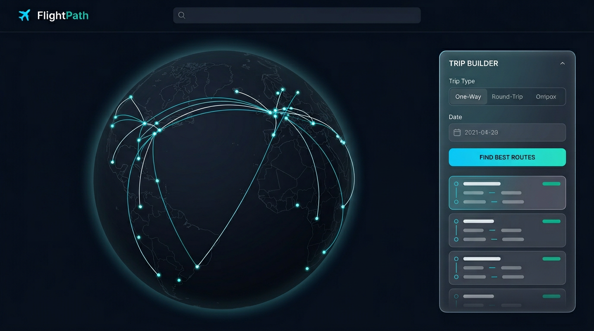

# FlightPath — Multi-City Flight Optimizer

A full-stack flight route optimizer that finds the best price-to-time tradeoff across multi-city itineraries, visualized on an interactive **3D globe** (great-circle routes, ranked results, and a floating trip builder panel).

## Preview

<p align="center">
  
</p>

<p align="center">
  <em>Representative UI mockup. Replace with a screen recording or GIF if you prefer—see <a href="#replacing-the-preview-media">Replacing the preview media</a>.</em>
</p>

## Architecture

```
┌─────────────────────────────────────┐
│          React Frontend             │
│  3D globe (react-globe.gl)          │
│  Floating trip panel · α slider     │
└──────────────┬──────────────────────┘
               │ REST API
┌──────────────▼──────────────────────┐
│         FastAPI Backend             │
│  ┌─────────────────────────────┐    │
│  │   Route Optimizer (TSP)      │    │
│  │   - Brute force (≤8 cities)  │    │
│  │   - Simulated annealing      │    │
│  └─────────────┬───────────────┘    │
│  ┌─────────────▼───────────────┐    │
│  │   Flight Data Service        │    │
│  │   - Amadeus API / mock data  │    │
│  └─────────────────────────────┘    │
│  ┌─────────────────────────────┐    │
│  │   RL Price Watch (future)    │    │
│  │   - Q-learning buy/wait      │    │
│  └─────────────────────────────┘    │
└─────────────────────────────────────┘
```

## Features

- **Multi-city route optimization** — round trip, multi-city, or flexible ordering
- **Price-to-time tradeoff slider** — adjust α to prioritize cost vs speed
- **Globe visualization** — great-circle arcs between cities, color-coded legs, airport markers
- **Itinerary ranking** — top routes scored and compared
- **RL price watch (planned)** — per-leg buy/wait recommendations

## Tech Stack

- **Frontend**: React 18, Vite, Tailwind CSS, Framer Motion, [react-globe.gl](https://github.com/vasturiano/react-globe.gl) / Three.js, TanStack Query
- **Backend**: Python 3.11+, FastAPI, Pydantic
- **Optimizer**: itertools (exact), simulated annealing (heuristic)
- **Flight data**: Amadeus API or in-process mock flights (`USE_MOCK_DATA`)

## Quick Start

### Backend

```bash
cd backend
python -m venv venv
source venv/bin/activate  # Windows: venv\Scripts\activate
pip install -r requirements.txt
cp .env.example .env      # Add your API keys
uvicorn app.main:app --reload --port 8000
```

### Frontend

```bash
cd frontend
npm install
cp .env.example .env
npm run dev
```

Open the URL Vite prints (usually `http://localhost:5173`).

## Environment Variables

### Backend `.env`

```
AMADEUS_API_KEY=your_key
AMADEUS_API_SECRET=your_secret
USE_MOCK_DATA=true          # Set false to use real Amadeus API
```

### Frontend `.env`

```
VITE_API_BASE_URL=http://localhost:8000
```

## Project Structure

```
flight/
├── docs/
│   └── readme-preview.png       # README hero image (optional: add demo.gif)
├── backend/
│   ├── app/
│   │   ├── main.py              # FastAPI app entry
│   │   ├── config.py            # Settings & env vars
│   │   ├── routers/
│   │   │   ├── flights.py       # /api/flights endpoints
│   │   │   └── optimize.py      # /api/optimize endpoints
│   │   ├── services/
│   │   │   ├── flight_service.py    # Amadeus API / mock data
│   │   │   ├── optimizer.py         # TSP route optimizer
│   │   │   └── scorer.py            # Price-time scoring
│   │   └── models/
│   │       ├── flight.py        # Pydantic models
│   │       └── itinerary.py     # Route/itinerary models
│   ├── requirements.txt
│   └── .env.example
├── frontend/
│   ├── src/
│   │   ├── App.jsx              # Root layout & trip panel
│   │   ├── main.jsx             # Entry point
│   │   ├── components/
│   │   │   ├── MapView.jsx      # 3D globe, arcs, airports
│   │   │   ├── CitySearch.jsx   # Autocomplete city input
│   │   │   ├── ItineraryPanel.jsx   # Route results
│   │   │   ├── TradeoffSlider.jsx   # α slider
│   │   │   └── FlightCard.jsx       # Per-leg flight info
│   │   ├── hooks/
│   │   │   └── useOptimizer.js  # API hook
│   │   ├── utils/
│   │   │   ├── geo.js           # Great-circle math
│   │   │   └── formatApiError.js
│   │   ├── theme/
│   │   │   └── tokens.js
│   │   ├── data/
│   │   │   └── macroGlobeLabels.json
│   │   └── styles/
│   │       └── index.css        # Global styles
│   ├── public/
│   │   └── geo/
│   │       └── ne_110m_admin_0_countries.geojson
│   ├── index.html
│   ├── package.json
│   ├── vite.config.js
│   ├── tailwind.config.js
│   ├── postcss.config.js
│   └── .env.example
├── README.md
└── .impeccable.md               # UI design notes (optional)
```

## Replacing the preview media

To use a **screen recording** or **GIF** instead of (or in addition to) the static image:

1. Capture the running app (e.g. macOS Screenshot / QuickTime, or [Kap](https://getkap.co/) for GIF).
2. Save as `docs/demo.gif` (or `.mp4` on GitHub you can link in Releases or host elsewhere).
3. In this README, add below the screenshot, for example:

```markdown

```

For **YouTube or Loom**, use a normal markdown link or thumbnail image linking to the video URL.

## Future Enhancements

- [ ] RL-based price watch agent (Q-learning per leg)
- [ ] Historical price chart per route
- [ ] Airport alternatives (e.g., BOS vs PVD)
- [ ] Layover quality scoring
- [ ] User accounts & saved trips
